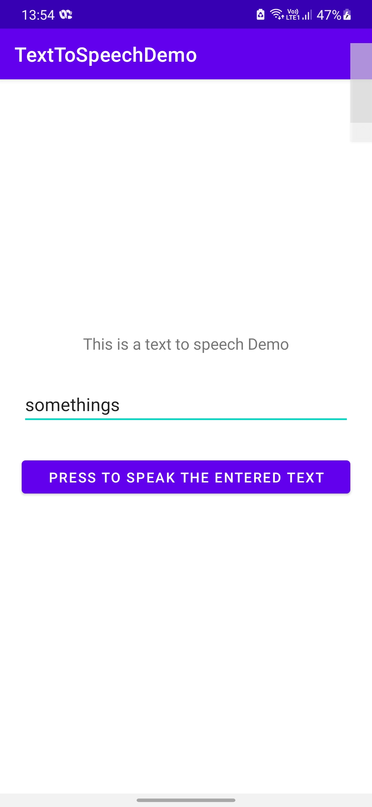

# Text To Speech Implementation
Here, in this particular example I have tried to cover the Text to Speech implementation
 
in android using kotlin language

To use this Demo Clone this repository or just copy and paste
 
the code in MainActivity.kt and activity_main.xml to your project
 
I will recommend to clone this repositor, as the settings in the projects may differ...

